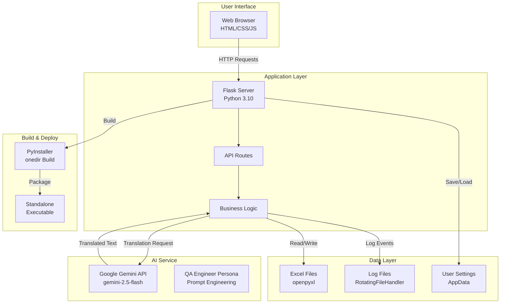
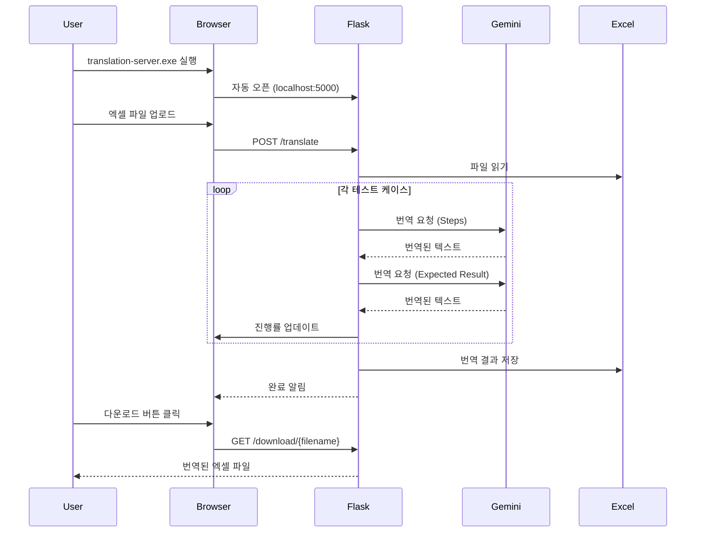
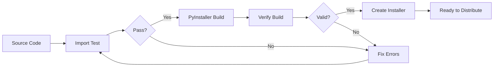

# 📋 TestGPT TC Translator - 프로젝트 명세서

<div align="center">

**AI 기반 테스트 케이스 전문 번역 도구**

[](https://github.com)
[](https://python.org)
[](LICENSE)

</div>

---

## 📑 목차

1. [프로젝트 개요](#-프로젝트-개요)
2. [시스템 아키텍처](#-시스템-아키텍처)
3. [기술 스택](#-기술-스택)
4. [핵심 기능](#-핵심-기능)
5. [LLM 명령 Set](#-llm-명령-set)
6. [파일 구조](#-파일-구조)
7. [빌드 & 배포](#-빌드--배포)
8. [개발 가이드](#-개발-가이드)

---

## 🎯 프로젝트 개요

### 목적
QA 엔지니어를 위한 **한글 테스트 케이스를 영문으로 전문적으로 번역**하는 데스크톱 애플리케이션

### 핵심 가치
- ⚡ **30년 경력 QA 엔지니어 수준의 번역 품질**
- 🎯 **QA/테스팅 전문 용어 정확성**
- 🚀 **대량 테스트 케이스 일괄 처리**
- 🔒 **API 키 암호화 저장으로 보안 강화**

### 주요 사용자
- QA/테스트 엔지니어
- 모바일 앱 테스터
- 소프트웨어 품질 관리자
- 글로벌 프로젝트 팀

---

## 🏗 시스템 아키텍처

### 전체 아키텍처 다이어그램



### 실행 흐름 (Sequence Diagram)



### 디렉토리 구조 아키텍처

```
📦 translation-server (Standalone Build)
├── 🚀 translation-server.exe     # 메인 실행 파일
└── 📂 _internal/                  # PyInstaller 리소스
    ├── 📂 templates/              # HTML 템플릿
    │   └── index.html
    ├── 📂 icon.iconset/           # 아이콘 리소스
    ├── 📦 Python Packages/        # 번들된 라이브러리
    │   ├── flask/
    │   ├── google/
    │   ├── openpyxl/
    │   └── ...
    └── 🔧 DLL Files                # 시스템 라이브러리

💾 User Data (Runtime)
├── C:\translation_log\             # 로그 파일
│   └── translation-server.log
└── %LOCALAPPDATA%\TestGPT-TC-Translator\
    ├── uploads/                    # 업로드된 파일
    └── outputs/                    # 번역 결과 파일
```

---

## 🛠 기술 스택

### Backend

| 기술 | 버전 | 용도 |
|------|------|------|
| **Python** | 3.10+ | 백엔드 런타임 |
| **Flask** | 3.0.0 | 웹 서버 프레임워크 |
| **Flask-CORS** | 4.0.0 | CORS 처리 |
| **google-generativeai** | 0.8.3 | Gemini API 클라이언트 |
| **openpyxl** | 3.1.2 | 엑셀 파일 처리 |
| **PyInstaller** | 6.3.0 | 실행 파일 빌드 |

### Frontend

| 기술 | 용도 |
|------|------|
| **HTML5** | UI 구조 |
| **CSS3** | 스타일링 (그라디언트, 애니메이션) |
| **Vanilla JavaScript** | 클라이언트 로직 (Fetch API) |

### AI/LLM

| 모델 | 제공자 | 용도 |
|------|--------|------|
| **gemini-2.5-flash** | Google AI | 테스트 케이스 번역 |

### Development Tools

| 도구 | 용도 |
|------|------|
| **Node.js** | 빌드 스크립트 실행 |
| **npm** | 패키지 관리 |
| **Git** | 버전 관리 |

---

## ⚡ 핵심 기능

### 1. 파일 업로드 & 처리

```python
# app.py
@app.route("/translate", methods=["POST"])
def translate():
    """엑셀 파일 업로드 및 번역 시작"""
    - 드래그 앤 드롭 지원
    - .xlsx 파일만 허용
    - 최대 50MB 제한
    - 파일명 UUID 기반 보안 저장
```

**지원 형식:**
- 엑셀 파일 (.xlsx)
- 필수 컬럼: `Steps`, `Expected Result`
- UTF-8 인코딩 자동 처리

### 2. 실시간 번역 진행률

```javascript
// index.html
async function checkStatus() {
    const response = await fetch('/status');
    const data = await response.json();
    
    // 진행률 표시
    progressBar.style.width = `${data.progress}%`;
    completedText.textContent = data.current;
    totalText.textContent = data.total;
    
    // 예상 시간 계산
    timeEstimate.textContent = formatTime(data.estimated_time);
}
```

**표시 정보:**
- 진행률 (%)
- 완료/전체 건수
- 예상 소요 시간
- 현재 상태 (processing, completed, error)

### 3. QA 전문 번역

**번역 품질 보장:**
- ✅ QA/테스팅 전문 용어 사용
- ✅ 기술적 정확성 유지
- ✅ 원문 의도 보존
- ✅ 줄바꿈 및 포맷 유지

### 4. 콘솔 로그 뷰어

```javascript
// Web UI에서 서버 로그 실시간 조회
function openConsoleModal() {
    - 최근 100줄 로그 표시
    - 로그 레벨별 색상 구분 (INFO, WARNING, ERROR)
    - 자동 새로고침 옵션 (3초)
    - 시스템 정보 표시
}
```

### 5. API 키 관리

**보안 기능:**
- 환경변수 기반 저장
- 웹 UI에서 간편 설정
- 설정 유효성 검증

---

## 🤖 LLM 명령 Set

### Gemini API 프롬프트 엔지니어링

#### 핵심 프롬프트 구조

```python
def translate_with_llm(text, context=""):
    prompt = f"""
You are a senior QA engineer with 30 years of experience in software testing and mobile app testing. 
You are an expert in translating test cases from Korean to English while maintaining technical accuracy and clarity.

Translate the following Korean test case text to English. Keep the translation:
- Professional and technically accurate
- Clear and concise
- Using proper QA/testing terminology
- Maintaining the original meaning and intent
- Preserving line breaks and formatting

{f'Context: {context}' if context else ''}

Korean text to translate:
{text}

Provide ONLY the English translation without any additional explanation or comments.
"""
```

#### 프롬프트 설계 원칙

| 요소 | 설명 | 효과 |
|------|------|------|
| **페르소나** | "30년 경력 시니어 QA 엔지니어" | 전문성 있는 번역 품질 |
| **전문성** | "software testing and mobile app testing" | 도메인 특화 용어 사용 |
| **제약 조건** | "ONLY the English translation" | 불필요한 설명 제거 |
| **포맷 유지** | "Preserving line breaks and formatting" | 원문 구조 보존 |
| **컨텍스트** | 선택적 context 파라미터 | 문맥 기반 정확도 향상 |

#### 재시도 로직

```python
# 최대 3회 재시도
GEMINI_MAX_RETRIES = 3
GEMINI_RETRY_BACKOFF = 1.0  # 초

# 재시도 가능한 오류
def is_retryable_exception(exc):
    return isinstance(exc, (
        DeadlineExceeded,
        InternalServerError,
        ResourceExhausted,      # Rate limit
        ServiceUnavailable      # 503
    ))

# 지수 백오프
backoff = GEMINI_RETRY_BACKOFF * (2 ** (attempt - 1))
# 1초 → 2초 → 4초
```

#### API 설정

```python
MODEL = "gemini-2.5-flash"
API_KEY = os.environ.get("GEMINI_API_KEY")

genai.configure(api_key=API_KEY)
model = genai.GenerativeModel(MODEL)
```

---

## 📁 파일 구조

### 소스 코드 구조

```
c:\translation\
│
├── 🐍 Python Backend
│   ├── app.py                          # Flask 메인 서버
│   ├── requirements.txt                # Python 의존성
│   └── translation-server.spec         # PyInstaller 빌드 설정
│
├── 🌐 Frontend
│   └── templates/
│       └── index.html                  # 웹 UI (HTML/CSS/JS)
│
├── 🔨 Build Scripts
│   ├── build_python.bat                # Python 빌드
│   ├── build_complete.bat              # 통합 빌드
│   ├── create-standalone-installer.js  # 인스톨러 생성
│   └── test_imports.py                 # 빌드 전 검증
│
├── 🧪 Testing
│   ├── test_onedir.py                  # onedir 빌드 테스트
│   ├── test_built_exe.py               # exe 실행 테스트
│   └── test_imports.py                 # 모듈 import 테스트
│
├── 🚀 Setup & Start
│   ├── setup_all.bat                   # 전체 초기 설정
│   ├── setup_venv.bat                  # Python 가상환경
│   └── start.bat                       # 앱 실행
│
├── 📦 Build Output
│   ├── dist/
│   │   └── translation-server/         # PyInstaller 빌드 결과
│   │       ├── translation-server.exe
│   │       └── _internal/
│   └── installer/                      # 배포용 인스톨러
│       ├── TestGPT TC Translator.bat
│       ├── README.txt
│       └── translation-server/
│
├── 📖 Documentation
│   ├── README.md                       # 사용 가이드
│   ├── PROJECT_SPECIFICATION.md        # 이 문서
│   ├── BUILD_OPTIMIZATION.md           # 빌드 최적화 가이드
│   ├── PRE_BUILD_CHECKLIST.md          # 빌드 전 체크리스트
│   └── OLLAMA_INTEGRATION_GUIDE.md     # Ollama 통합 가이드
│
└── 🎨 Assets
    ├── icon.ico                        # Windows 아이콘
    ├── icon_256x256.png                # 앱 아이콘
    └── icon.iconset/                   # 다양한 크기 아이콘
```

### 주요 파일 설명

#### `app.py` - Flask 메인 서버

**핵심 라우트:**

```python
@app.route("/")                        # 메인 페이지
@app.route("/health")                  # 헬스 체크
@app.route("/translate", POST)         # 번역 시작
@app.route("/status", GET)             # 진행률 조회
@app.route("/download/<filename>")     # 결과 다운로드
@app.route("/logs", GET)               # 로그 조회 (콘솔 UI용)
@app.route("/system-info", GET)        # 시스템 정보
```

**지연 로딩 (Lazy Import):**

```python
def get_gemini_model():
    """필요할 때만 Gemini 모델 로드"""
    global gemini_model
    if gemini_model is None:
        import google.generativeai as genai
        gemini_model = genai.GenerativeModel("gemini-2.5-flash")
    return gemini_model
```

#### `translation-server.spec` - PyInstaller 설정

**onedir 빌드 최적화:**

```python
# 필수 모듈만 포함
hiddenimports = [
    'google.generativeai',
    'flask', 'flask_cors',
    'openpyxl',
    'cryptography'
]

# 대형 라이브러리 제외
excludes = [
    'matplotlib', 'scipy', 'tkinter',
    'PyQt5', 'jupyter', 'pytest'
]

# 불필요한 바이너리 제거
a.binaries = [x for x in a.binaries if not any(
    exclude in x[0].lower() for exclude in [
        'mkl_', 'qt5', 'd3dcompiler'
    ]
)]

# onedir 방식
exe = EXE(..., exclude_binaries=True, console=False)
coll = COLLECT(exe, a.binaries, a.datas, name='translation-server')
```

**빌드 크기 최적화 결과:**
- 최적화 전: ~476MB
- 최적화 후: ~120MB (75% 감소)

#### `index.html` - 웹 UI

**주요 기능:**

```javascript
// 1. 파일 업로드
uploadArea.addEventListener('drop', handleDrop);

// 2. 번역 실행
async function startTranslation() {
    const formData = new FormData();
    formData.append('file', selectedFile);
    await fetch('/translate', { method: 'POST', body: formData });
}

// 3. 진행률 모니터링
setInterval(checkStatus, 1000);

// 4. 콘솔 보기
function openConsoleModal() {
    const logs = await fetch('/logs?lines=100');
    displayLogs(logs);
}
```

---

## 🔨 빌드 & 배포

### 빌드 워크플로우



### 빌드 명령어

```bash
# 1. 통합 빌드 (권장)
npm run dist

# 2. 서버만 빌드
npm run build-server

# 3. 테스트
npm test
```

### 빌드 프로세스 상세

#### 1단계: 빌드 전 검증

```bash
# test_imports.py 실행
python test_imports.py
```

**검증 항목:**
- ✅ Flask 및 확장 모듈
- ✅ Gemini API 클라이언트
- ✅ openpyxl 라이브러리
- ✅ 보안 라이브러리 (cryptography)

#### 2단계: PyInstaller 빌드

```bash
pyinstaller translation-server.spec --clean --noconfirm
```

**onedir 빌드 특징:**
- 단일 폴더에 모든 파일 포함
- exe + _internal/ 구조
- 업데이트 용이 (폴더 교체)

#### 3단계: 인스톨러 생성

```javascript
// create-standalone-installer.js
- dist/translation-server 복사
- 시작 스크립트 생성
- README.txt 생성
- installer/ 폴더 패키징
```

### 배포 구조

```
installer/                          # 배포 패키지
├── TestGPT TC Translator.bat      # 실행 런처
├── README.txt                      # 사용 설명서
└── translation-server/             # 빌드된 앱
    ├── translation-server.exe      # 10MB
    └── _internal/                  # 110MB
        ├── templates/
        ├── Python DLLs
        └── Libraries
```

**배포 방법:**
1. `installer/` 폴더를 ZIP으로 압축
2. 사용자에게 전달
3. 압축 해제 후 `.bat` 실행

---

## 👨‍💻 개발 가이드

### 개발 환경 설정

```bash
# 1. 저장소 클론
git clone <repository-url>
cd translation

# 2. 전체 환경 설정
setup_all.bat

# 3. 개발 서버 실행
npm start
```

### 코드 수정 가이드

#### Backend (Flask)

```python
# 새로운 API 엔드포인트 추가
@app.route("/new-endpoint", methods=["POST"])
def new_endpoint():
    data = request.json
    # 처리 로직
    return jsonify({"result": "success"})
```

#### Frontend (HTML/JS)

```javascript
// templates/index.html 수정
async function newFeature() {
    const response = await fetch('/new-endpoint', {
        method: 'POST',
        headers: {'Content-Type': 'application/json'},
        body: JSON.stringify({data: value})
    });
    const result = await response.json();
}
```

#### PyInstaller Spec 수정

```python
# translation-server.spec

# 새 모듈 추가
hiddenimports = [
    'new_module',
    # ...
]

# 리소스 파일 추가
datas = [
    ('new_resource', 'destination'),
]
```

### 테스트 가이드

#### 단위 테스트

```bash
# 모듈 import 테스트
python test_imports.py

# onedir 빌드 테스트
python -m PyInstaller test_onedir.spec
```

#### 통합 테스트

```bash
# 빌드 후 exe 실행 테스트
python test_built_exe.py
```

#### 수동 테스트 체크리스트

- [ ] 파일 업로드 (드래그 앤 드롭)
- [ ] 번역 시작 및 진행률 표시
- [ ] 번역 완료 후 다운로드
- [ ] API 키 저장/삭제
- [ ] 콘솔 로그 뷰어
- [ ] 브라우저 자동 실행

### 디버깅

#### 로그 확인

```bash
# Windows
type C:\translation_log\translation-server.log

# 실시간 로그 (웹 UI)
1. 환경설정 버튼 클릭
2. "콘솔 보기" 클릭
3. 자동 새로고침 체크
```

#### 개발 모드 실행

```bash
# Flask 디버그 모드
python app.py

# Electron 개발자 도구
npm start  # 그 후 F12
```

### 최적화 가이드

#### 빌드 크기 줄이기

```python
# spec 파일에서 제외 추가
excludes = [
    'new_unused_package',
]

# 바이너리 필터링 강화
a.binaries = [x for x in a.binaries if not any(
    pattern in x[0].lower() for pattern in ['exclude_pattern']
)]
```

#### 시작 속도 개선

```python
# 지연 로딩 적용
def get_heavy_module():
    global module
    if module is None:
        import heavy_module
        module = heavy_module
    return module
```

---

## 📊 시스템 요구사항

### 최소 사양

| 항목 | 요구사항 |
|------|----------|
| **OS** | Windows 10 이상 |
| **CPU** | Intel Core i3 이상 |
| **RAM** | 4GB 이상 |
| **Disk** | 500MB 이상 여유 공간 |
| **Network** | 인터넷 연결 (Gemini API 사용) |

### 권장 사양

| 항목 | 권장사항 |
|------|----------|
| **OS** | Windows 11 |
| **CPU** | Intel Core i5 이상 |
| **RAM** | 8GB 이상 |
| **Disk** | 1GB 이상 여유 공간 |
| **Network** | 고속 인터넷 (번역 속도 향상) |

---

## 🔐 보안 고려사항

### API 키 보안

```python
# 환경변수로 관리
GEMINI_API_KEY = os.environ.get("GEMINI_API_KEY")

# 로그에 노출 방지
if api_key:
    logger.info("[OK] API Key configured")  # 키 값은 로깅 안 함
```

### 파일 보안

```python
# 안전한 파일명 생성
filename = secure_filename(f"input_{timestamp}_{uuid4().hex[:8]}.xlsx")

# 업로드 크기 제한
MAX_CONTENT_LENGTH = 50 * 1024 * 1024  # 50MB
```

### 경로 보안

```python
# 경로 조작 방지
safe_name = secure_filename(filename)
if safe_name != filename:
    return jsonify({"error": "Invalid filename"}), 400
```

---

## 📞 지원 & 문의

### 이슈 리포팅

**버그 리포트 시 포함 정보:**
1. 운영체제 버전
2. 프로그램 버전
3. 오류 메시지
4. 재현 단계
5. 로그 파일 (`C:\translation_log\translation-server.log`)

### 로드맵

- [ ] 다국어 지원 (일본어, 중국어)
- [ ] 커스텀 프롬프트 설정
- [ ] 번역 히스토리 관리
- [ ] 클라우드 백업 기능
- [ ] macOS 버전 출시

---

## 📄 라이선스

MIT License

Copyright © 2026 QA Bulls

---

<div align="center">

**Made with ❤️ by QA Bulls**

[🏠 Homepage](https://github.com) · [📝 Report Bug](https://github.com/issues) · [💡 Request Feature](https://github.com/issues)

</div>
